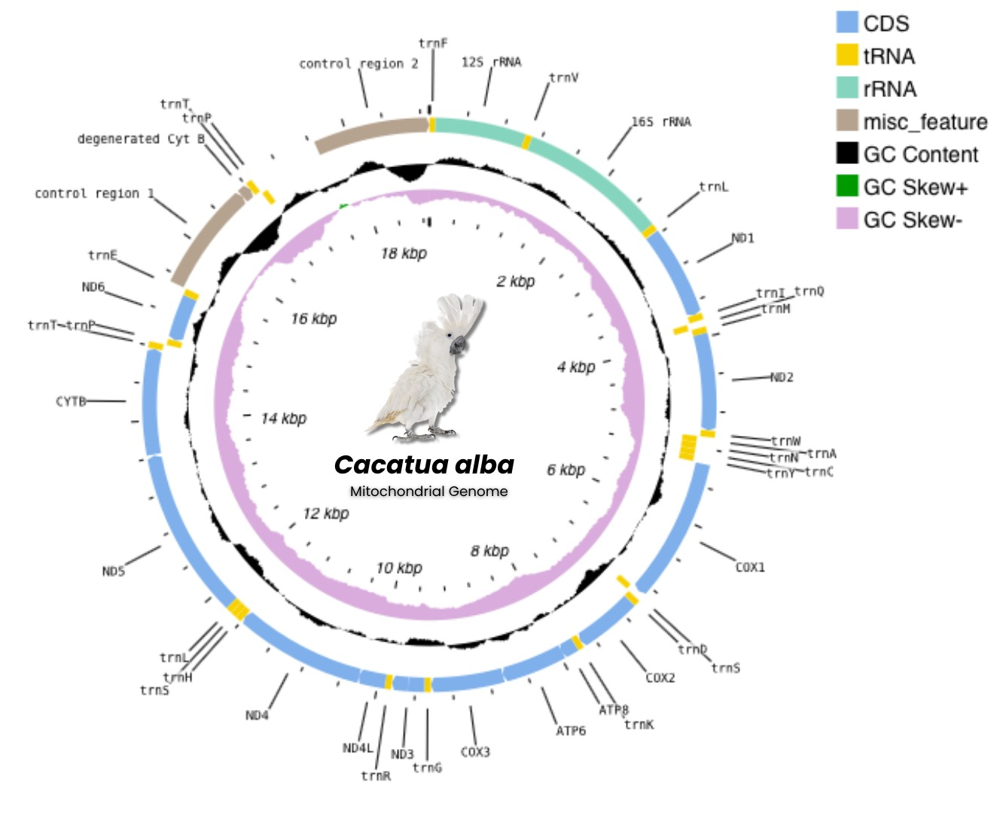
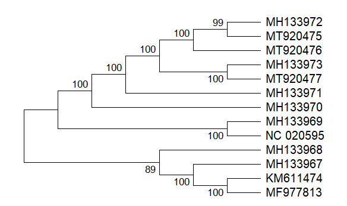
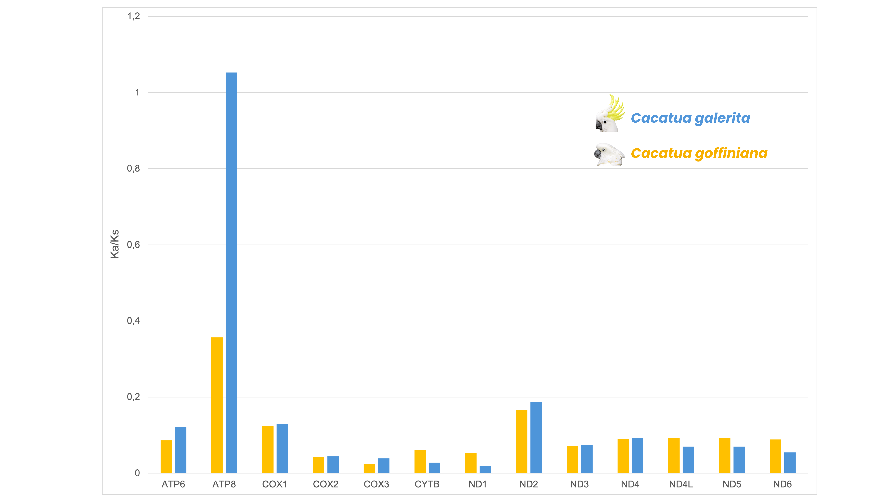
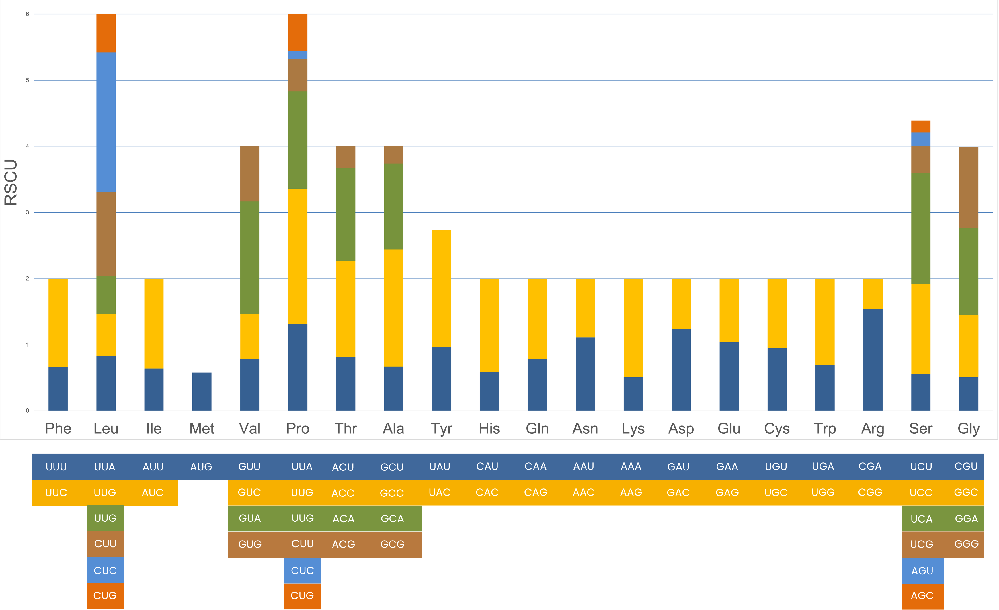

# CREST : Cacatua alba Research on Evolution, Selection Pressure, and Codon Usage Trends

> **Adelia Yusuf Ardhani, Diandra Azhariyavi Insiraty, Diva Septiani, Ihsanul Fikri Alfarizel, Zafiero Hasby Dzikri** | Universitas Gadjah Mada  
> Course: [BIOINFORMATICS]  
> Accession: MT920475 | Tools: Geneious Prime · MEGA 12 · Proksee · Microsoft Excel

---

## Table of Contents
1. [Project Overview](#project-overview)
2. [Species Information](#species-information)
3. [Workflow](#workflow)
4. [Methods](#methods)
   - [1. Data Acquisition](#1-data-acquisition)
   - [2. Annotation Check](#2-annotation-check)
   - [3. Mitogenome Visualization](#3-mitogenome-visualization)
   - [4. Multiple Sequence Alignment](#4-multiple-sequence-alignment)
   - [5. Phylogenetic Analysis](#5-phylogenetic-analysis)
   - [6. Ka/Ks Analysis](#6-kaks-analysis)
   - [7. RSCU Analysis](#7-rscu-analysis)
5. [Results](#results)
6. [Species List & Accession Numbers](#species-list--accession-numbers)
7. [References](#references)

---

## Project Overview

This repository documents the complete workflow for comparative mitogenomic analysis of *Cacatua alba* (White Cockatoo), an Endangered species endemic to the Maluku Islands, Indonesia. The analysis includes mitogenome visualization, phylogenetic reconstruction, selection pressure estimation (Ka/Ks), and codon usage analysis (RSCU).

---

## Species Information

| Feature | Detail |
|---|---|
| Species | *Cacatua alba* (Müller, 1776) |
| Common name | White Cockatoo / Kakatua Putih |
| Order | Psittaciformes |
| Family | Cacatuidae |
| IUCN Status | **Endangered** |
| CITES | Appendix II |
| Mitogenome accession | MT920475 |
| Mitogenome length | 18,894 bp |
| Gene content | 13 PCGs, 24 tRNA, 2 rRNA, 2 Control Regions, 3 degenerated genes |

---

## Workflow

```
NCBI GenBank (NC_020595.1)
        │
        ▼
Annotation Check (Geneious Prime)
        │
        ▼
Mitogenome Visualization (Proksee)
        │
        ▼
Multiple Sequence Alignment — MAFFT default (Geneious Prime)
        │
        ├──────────────────────┬──────────────────────┐
        ▼                      ▼                      ▼
Phylogenetic Analysis     Ka/Ks Analysis         RSCU Analysis
  (MEGA 12, ML)           (MEGA 12 +             (MEGA 12 +
  1000 bootstrap          manual Excel)          manual Excel)
```

---

## Methods

### 1. Data Acquisition

The complete mitogenome of *Cacatua alba* was retrieved from NCBI GenBank (accession: **NC_020595.1**) in GenBank (.gb) and FASTA (.fasta) formats. Additional mitogenome sequences of closely related Cacatuidae species were also downloaded for comparative analysis (see [Species List](#species-list--accession-numbers)).

### 2. Annotation Check

Mitogenome annotation was verified using **Geneious Prime** software. The annotation includes:
- 13 Protein-Coding Genes (PCGs)
- 24 transfer RNA (tRNA) genes
- 2 ribosomal RNA (rRNA) genes: 12S rRNA and 16S rRNA
- 2 Control Regions (CR1 and CR2)
- 3 degenerated genes: *degenerated cytb*, *degenerated nd6*, *degenerated tRNA-Glu*

Genetic code used: **NCBI Genetic Code No. 2** (Vertebrate Mitochondrial).

### 3. Mitogenome Visualization

Circular mitogenome map was generated using **Proksee** ([proksee.ca](https://proksee.ca)).

- Input: GenBank file (NC_020595.1, .gb format)
- Tracks displayed: CDS, tRNA, rRNA, misc_feature, GC Content, GC Skew+, GC Skew−
- GC Skew calculated as: **GC Skew = (G − C) / (G + C)**


*Figure 1. Circular map of the complete mitogenome of Cacatua alba (NC_020595.1) visualized using Proksee.*

### 4. Multiple Sequence Alignment

Multi-sequence alignment of 13 concatenated PCGs from 14 Cacatuidae species was performed using **MAFFT** with default settings, implemented within **Geneious Prime**.

- Algorithm: MAFFT (default parameters)
- Input: 13 PCG sequences per species in FASTA format
- Sequences concatenated in Geneious Prime prior to alignment

### 5. Phylogenetic Analysis

Phylogenetic tree was reconstructed using **Maximum Likelihood (ML)** method in **MEGA 12** with all default settings.

- Method: Maximum Likelihood
- Bootstrap replicates: **1,000**
- All parameters: MEGA 12 default
- Dataset: 13 concatenated PCGs from 14 species (12 Cacatuidae + 2 outgroup)
- Outgroup: *Strigops habroptila* and *Nestor notabilis* (Strigopidae)


*Figure 2. Maximum Likelihood phylogenetic tree of Cacatuidae based on 13 concatenated PCGs. Bootstrap values (1000 replicates) are shown at each node.*

**Key results:**
- *C. alba* + *C. moluccensis* → monophyletic clade (bootstrap 99)
- Genus *Cacatua* confirmed monophyletic (bootstrap 100)
- Three subfamilies resolved: Cacatuinae, Calyptorhynchinae, Nymphicinae

### 6. Ka/Ks Analysis

Synonymous (Ks) and nonsynonymous (Ka) substitution rates were calculated using **MEGA 12** with default settings (Nei-Gojobori method). Ka/Ks ratios for each of the 13 PCGs were then calculated manually in **Microsoft Excel** for each pairwise comparison:

- *C. alba* vs *C. galerita*
- *C. alba* vs *C. goffiniana*

**Interpretation thresholds:**
| Ka/Ks value | Interpretation |
|---|---|
| < 1 | Purifying (negative) selection |
| = 1 | Neutral evolution |
| > 1 | Positive (adaptive) selection |


*Figure 3. Ka/Ks ratios of 13 PCGs comparing C. alba with C. galerita and C. goffiniana.*

**Key results:**
- All PCGs under **purifying selection** (Ka/Ks << 1)
- **ATP8**: Ka/Ks ≈ 1.05 (*C. alba* vs *C. galerita*) — highest among all PCGs
- **COX1**: Ka/Ks ≈ 0.05–0.12 — most conserved gene

### 7. RSCU Analysis

Relative Synonymous Codon Usage (RSCU) was calculated using the **Codon Usage function in MEGA 12** with default settings. RSCU values were then computed manually in **Microsoft Excel** using the formula:

$$RSCU_{ij} = \frac{x_{ij}}{\frac{1}{n_i} \sum_{j=1}^{n_i} x_{ij}}$$

Where:
- $x_{ij}$ = observed frequency of codon *j* for amino acid *i*
- $n_i$ = number of synonymous codons for amino acid *i*
- RSCU > 1 = preferred codon; RSCU < 1 = avoided codon


*Figure 4. RSCU values of all synonymous codons in the 13 PCGs of Cacatua alba.*

**Key results:**
- Dominant codons end in **A or U** (wobble position) → AT-rich bias
- Leucine (Leu) and Serine (Ser): highest RSCU complexity (total ≈ 6.0)
- Tyrosine (Tyr): RSCU ≈ 2.75, strongly preferring codon UAU
- Consistent with AT-rich codon bias reported in Psittaciformes

---

## Results

| Analysis | Key Finding |
|---|---|
| Mitogenome structure | 18,894 bp; 2 control regions; 3 degenerated genes — unique in Cacatuidae |
| GC Skew | Strongly negative → asymmetric replication-driven composition |
| Phylogeny | *C. alba* sister to *C. moluccensis*; Cacatua monophyletic (bootstrap 100) |
| Ka/Ks | Purifying selection dominant; ATP8 shows possible positive selection vs *C. galerita* |
| RSCU | AT-rich codon bias; Leu and Ser most complex; mutation pressure drives bias |

---

## Species List & Accession Numbers

| No | Species | Accession Number | Family | Reference |
|---|---|---|---|---|
| 1 | *Cacatua alba* | MT920475 | Cacatuidae | Kim et al. (2021) |
| 2 | *Cacatua galerita* | MT920476 | Cacatuidae | Kim et al. (2021) |
| 3 | *Cacatua goffiniana* | MT920477 | Cacatuidae | Kim et al. (2021) |
| 4 | *Cacatua moluccensis* | MH133972 | Cacatuidae | Urantówka et al. (2018) |
| 5 | *Cacatua pastinator* | MH133973 | Cacatuidae | Urantówka et al. (2018) |
| 6 | *Eolophus roseicapillus* | MH133971 | Cacatuidae | Urantówka et al. (2018) |
| 7 | *Probosciger aterrimus* | MH133970 | Cacatuidae | Urantówka et al. (2018) |
| 8 | *Calyptorhynchus baudinii* | MH133969 | Cacatuidae | Urantówka et al. (2018) |
| 9 | *Calyptorhynchus lathami* | JF414241 | Cacatuidae | White et al. (2011) |
| 10 | *Calyptorhynchus latirostris* | JF424243 | Cacatuidae | White et al. (2011) |
| 11 | *Nymphicus hollandicus* | MH133968 | Cacatuidae | Urantówka et al. (2018) |
| 12 | *Nestor notabilis* | MH133967 | Cacatuidae | Urantówka et al. (2018) |
| 13 | *Strigops habroptila* | AY309456 | Strigopidae | Harrison et al. (2004) |

---

## References

- Boore, J.L. (1999). Animal mitochondrial genomes. *Nucleic Acids Research*, 27, 1767–1780.
- Eberhard, J.R., Wright, T.F., & Bermingham, E. (2001). Duplication and concerted evolution of the mitochondrial control region in the parrot genus *Amazona*. *Molecular Biology and Evolution*, 18, 1330–1342.
- Hebert, P.D., et al. (2003). Biological identifications through DNA barcodes. *Proceedings of the Royal Society B*, 270, 313–321.
- Ikemura, T. (1985). Codon usage and tRNA content in unicellular and multicellular organisms. *Molecular Biology and Evolution*, 2, 13–34.
- Kim, J.-I., Do, T.D., Choi, Y., Yeo, Y., & Kim, C.-B. (2021). Characterization and comparative analysis of complete mitogenomes of three *Cacatua* parrots (Psittaciformes: Cacatuidae). *Genes*, 12, 209.
- Nei, M., & Gojobori, T. (1986). Simple methods for estimating the numbers of synonymous and nonsynonymous nucleotide substitutions. *Molecular Biology and Evolution*, 3, 418–426.
- Perna, N.T., & Kocher, T.D. (1995). Patterns of nucleotide composition at fourfold degenerate sites of animal mitochondrial genomes. *Journal of Molecular Evolution*, 41, 353–358.
- Urantówka, A.D., et al. (2018). New insight into parrots' mitogenomes indicates that their ancestor contained a duplicated region. *Molecular Biology and Evolution*, 35, 2989–3009.
- White, N.E., et al. (2011). The evolutionary history of cockatoos (Aves: Psittaciformes: Cacatuidae). *Molecular Phylogenetics and Evolution*, 59, 615–622.
- Zhang, J. (2004). Frequent false detection of positive selection by the likelihood method with branch-site models. *Molecular Biology and Evolution*, 21, 1332–1339.

---

<div align="center">

*Analysis conducted for academic purposes | Universitas Gadjah Mada*  
*Data source: NCBI GenBank | Tools: Geneious Prime · MEGA 12 · Proksee · Microsoft Excel*

</div>
